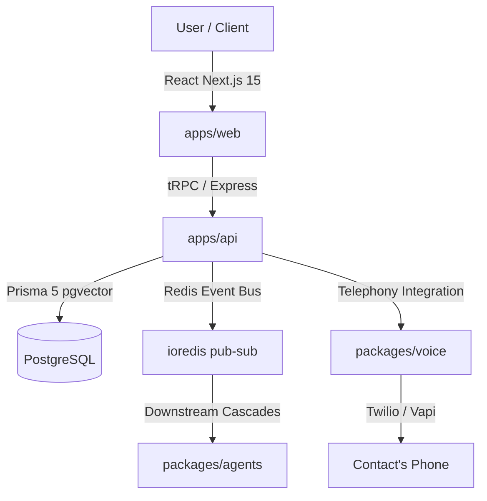

# VORTIQ — AI-Native Business OS for India 🇮🇳

VORTIQ is a highly advanced, regulatory-compliant, AI-native operating system designed to run modern Indian enterprises. Built with a Turborepo monorepo architecture, VORTIQ integrates 12 AI agents to automate CRM, support, logistics, billing, and outbound tele-sales.

---

## 🏗️ Architecture Overview



*   **apps/web**: Next.js 15 App Router interface utilizing dark-mode glassmorphism.
*   **apps/api**: Node.js Express server configured with tRPC v11 procedures.
*   **packages/db**: Prisma Client 5 database layer supporting PostgreSQL `pgvector`.
*   **packages/types**: Zod validation rules and tRPC API feature gate schemas.
*   **packages/agents**: Master orchestrator controlling 12 autonomous module agents sharing memory.
*   **packages/connectors**: Integration wrappers for Tally, Razorpay, Shiprocket, and Meta APIs.
*   **packages/voice**: Regulatory-compliant outbound dialers running on Vapi and ElevenLabs.

---

## 🇮🇳 India-First Regulatory Compliance

### 1. TRAI Outbound Calling Checklist
VORTIQ implements strict regulatory compliance safeguards directly into `packages/voice/src/voice-call.service.ts`:
*   **dlT 140/160 series Headers**: Telemarketing outbound caller IDs must belong to the TRAI-registered `140` or `160` number series.
*   **Calling Hour Compliance**: AI dialers only operate between **10:00 AM and 07:00 PM IST**. Outbound dialing queues are locked and terminated outside this window.
*   **NCPR DND Registry Scrubbing**: All phone numbers scrub against the NCPR register via the NCPR API connector before place calls. Numbers listed on DND are blocked instantly.
*   **AI Disclosure**: The calling script is engineered to disclose the calling representative is an AI assistant within the first **15 seconds** of the call.
*   **90-day Voice Retention**: Call recording URLs are flagged with a `recordingDeleteAt` expiry date set to 90 days post-call, prompting auto-deletion.

### 2. Digital Personal Data Protection (DPDP) Act 2023
*   Customers have an absolute right to withdraw outbound calling consent.
*   Outbound calling engines verify that `consentStatus` != `WITHDRAWN` before processing records.
*   If a customer mentions opting out, the call agent invokes the `remove_from_calls` tool, updating the database record immediately.

---

## 🚀 Setup Guides

### 1. Telegram Bot pairing Setup (BotFather)
1. Message `@BotFather` on Telegram.
2. Send `/newbot` and follow prompts to obtain a **Bot Token**.
3. Set `TELEGRAM_BOT_TOKEN` in your `.env`.
4. Run the API server; pairing verification codes can be generated in settings.

### 2. WhatsApp Business API Setup
1. Create a developer account on Meta Developers (https://developers.facebook.com).
2. Register a WhatsApp Business platform app.
3. Configure `META_WHATSAPP_PHONE_NUMBER_ID` and `META_WHATSAPP_ACCESS_TOKEN` in `.env`.
4. Setup templates in the Facebook App Manager for `vortiq_morning_briefing` and `vortiq_critical_alert`.

### 3. Exotel DLT Configuration
1. Register your business entity on any Indian DLT portal (Vilpower, DLT Jio, etc.) to get your Header ID and Principal Entity ID.
2. Purchase a 140-series virtual number through Exotel.
3. Set `EXOTEL_SID` and `EXOTEL_140_NUMBER` in your backend variables.

---

## 📦 Deployment Guide

### Railway (Backend API & Redis)
1. Link your git repository to Railway.
2. Provision a PostgreSQL Database and enable the vector extension:
    ```sql
    CREATE EXTENSION IF NOT EXISTS vector;
    ```
3. Provision a Redis instance.
4. Set up environment variables as shown in `.env.example`.

### Vercel (Next.js 15 Web Application)
1. Import `apps/web` into Vercel.
2. Set `NEXT_PUBLIC_APP_URL` and `API_URL` to point to your Railway API server.
3. Deploy.
